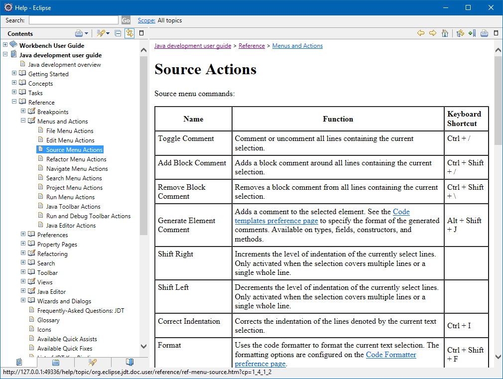

# Eclipse Cheat Sheet

1. `CTRL+Shift+R`
Open Resource - Open any file quickly without browsing for it in the Package Explorer

2. `CTRL+Shift+T`
Open Type - Open a type

3. `CTRL+O`
Go directly to a member
`CTRL+Shift+DOWN` or `CTRL+Shift+UP` to jump from member to member

4. `CTRL+L, enter line number`
Go to line number N in the source file

5. `CTRL+Q`
Go to the last edit location

6. `CTRL+T`
Go to a supertype/subtype

7. `CTRL+E`
Got to other open editors

8. `CTRL+.` for next, `CTRL+,` for previous problem
Move to one problem

9. `ALT+<-` (left arrow) and `ALT+->` (right arrow)
Hop back and forth through the files you have visited

10. `F3`
Go to a type declaration, alternatively hold CTRL down and click the hyperlinked variable or class

11. `F4`
Open type hierarchy to show subclasses of a class or interface.

`CTRL+Shift+G` - search for references to selected method or variable 
`CTRL+ALT+H` - show call hierarchy

Help >> Help Contents >> Java Development User Guide >> Reference >> Menus and Actions

http://rayfd.me/2007/05/20/10-eclipse-navigation-shortcuts-every-java-programmer-should-know/
