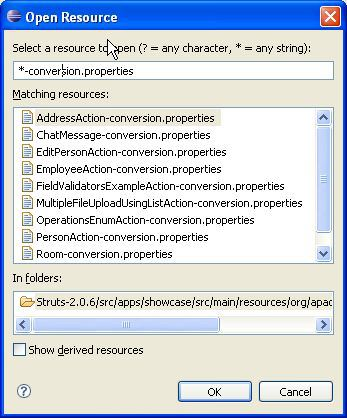

# Eclipse Cheat Sheet

1. Open Resource - Open any file quickly without browsing for it in the Package Explorer
```
CTRL+Shift+R
```


1. Open Type - Open a type
```
CTRL+Shift+T
```

1. `CTRL+O`
Go directly to a member
`CTRL+Shift+DOWN` or `CTRL+Shift+UP` to jump from member to member

1. `CTRL+L, enter line number`
Go to line number N in the source file

1. `ALT+Shift+S,R`
[Generate getters and setters](https://dzone.com/articles/generate-rename-and-delete)

1. `CTRL+Q`
Go to the last edit location

1. `CTRL+T`
Go to a supertype/subtype

1. `CTRL+E`
Got to other open editors

1. `CTRL+.` for next, `CTRL+,` for previous problem
Move to one problem

1. `ALT+<-` (left arrow) and `ALT+->` (right arrow)
Hop back and forth through the files you have visited

1. `F3`
Go to a type declaration, alternatively hold CTRL down and click the hyperlinked variable or class

1. `F4`
Open type hierarchy to show subclasses of a class or interface.

1. `CTRL+Shift+G` - search for references to selected method or variable<br/>

1. `CTRL+ALT+H` - show call hierarchy

1. `CTRL+.` - go to next error

1. `CTRL+F11` - run the application

1. `ALT+Shift+R` - rename

1. `CTRL+D` - delete a line

[Delete a line in Eclipse](https://stackoverflow.com/a/591185/6146580)

1. Navigate between tabs
* `CTRL+E`
* `CTRL+F6`
* `CTRL+Page Up`
* `CTRL+Page Down`

[Eclipse HotKey: how to switch between tabs?](https://stackoverflow.com/a/2332440)

Help >> Help Contents >> Java Development User Guide >> Reference >> Menus and Actions


http://rayfd.me/2007/05/20/10-eclipse-navigation-shortcuts-every-java-programmer-should-know/

It turns out the above link is dead but I captured it in Evernote. As time permits, I'll add the screen shots to this cheat sheet.
