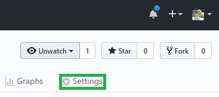
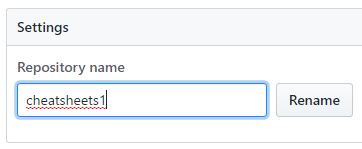

# GitHub Cheat Sheet

 ### Set up remote repository from the command line
 
`git remote add origin https://github.com/VijayNew/NewExample.git`

See http://stackoverflow.com/a/25504199/6146580.

### Rename a repository

Click on Settings.

Type in the new name and click on Rename.

See http://stackoverflow.com/a/2042020/6146580.
